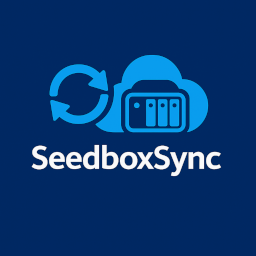

# SeedboxSync

[![Author][ico-bluesky]][link-bluesky]
[![Software License][ico-license]](LICENSE)
[![Build Status][ico-ghactions]][link-ghactions]

[![Latest Version][ico-pypi-version]][link-pypi]
[![Docker Pull][ico-docker]][link-docker]
[![Latest Version][ico-version]][link-docker]

[![Quality Gate Status][ico-sonarcloud-gate]][link-sonarcloud-gate]
[![Coverage][ico-sonarcloud-coverage]][link-sonarcloud-coverage]
[![Maintainability Rating][ico-sonarcloud-maintainability]][link-sonarcloud-maintainability]
[![Reliability Rating][ico-sonarcloud-reliability]][link-sonarcloud-reliability]
[![Security Rating][ico-sonarcloud-security]][link-sonarcloud-security]

  

**SeedboxSync** provides a seamless and automated way to synchronize, download, and manage your torrents between your NAS and seedbox.

## Key Features

* **🔄 Two-way synchronization**:
  * Sync from NAS to Seedbox (upload blackhole folder)
  * Sync from Seedbox to NAS (automatic download with de-duplication tracking)
* **📥 Download management**: Prevent duplicate transfers using an integrated SQLite database
* **📊 Statistics and reporting**: View monthly and yearly download statistics
* **✅ Quality and testing**: Over 80% unit test coverage
* **🌐 Web frontend**: A web front-end is also available as a separate project if you don't want to use the CLI for management and reporting.

## Full documentation

See: [https://llaumgui.github.io/seedboxsync/](https://llaumgui.github.io/seedboxsync/)

## Powered by

    

## License

Released under the [GPL v3](https://www.gnu.org/licenses/gpl-3.0.en.html).

[ico-bluesky]: https://img.shields.io/static/v1?label=Author&message=llaumgui&color=208bfe&logo=bluesky&style=flat-square
[link-bluesky]: https://bsky.app/profile/llaumgui.kulakowski.fr
[ico-ghactions]: https://img.shields.io/github/actions/workflow/status/llaumgui/seedboxsync/devops.yml?branch=main&style=flat-square&logo=github&label=DevOps
[link-ghactions]: https://github.com/llaumgui/seedboxsync/actions
[ico-pypi-version]: https://img.shields.io/pypi/v/seedboxsync?include_prereleases&label=Package%20version&style=flat-square&logo=python
[link-pypi]:https://pypi.org/project/seedboxsync/
[ico-license]: https://img.shields.io/github/license/llaumgui/seedboxsync?style=flat-square
[ico-docker]: https://img.shields.io/docker/pulls/llaumgui/seedboxsync?color=%2496ed&logo=docker&style=flat-square
[link-docker]: https://hub.docker.com/r/llaumgui/seedboxsync
[ico-version]: https://img.shields.io/docker/v/llaumgui/seedboxsync?sort=semver&color=%2496ed&logo=docker&style=flat-square
[ico-sonarcloud-gate]: https://sonarcloud.io/api/project_badges/measure?branch=main&project=llaumgui_seedboxsync&metric=alert_status
[link-sonarcloud-gate]: https://sonarcloud.io/dashboard?id=llaumgui_seedboxsync&branch=main
[ico-sonarcloud-coverage]: https://sonarcloud.io/api/project_badges/measure?project=llaumgui_seedboxsync&metric=coverage
[link-sonarcloud-coverage]: https://sonarcloud.io/dashboard?id=llaumgui_seedboxsync
[ico-sonarcloud-maintainability]: https://sonarcloud.io/api/project_badges/measure?project=llaumgui_seedboxsync&metric=sqale_rating
[link-sonarcloud-maintainability]: https://sonarcloud.io/dashboard?id=llaumgui_seedboxsync
[ico-sonarcloud-reliability]: https://sonarcloud.io/api/project_badges/measure?project=llaumgui_seedboxsync&metric=reliability_rating
[link-sonarcloud-reliability]: https://sonarcloud.io/dashboard?id=llaumgui_seedboxsync
[ico-sonarcloud-security]: https://sonarcloud.io/api/project_badges/measure?project=llaumgui_seedboxsync&metric=security_rating
[link-sonarcloud-security]: https://sonarcloud.io/dashboard?id=llaumgui_seedboxsync
