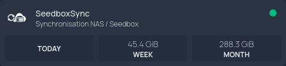

## What is Homepage?

[Homepage](https://gethomepage.dev/) is *"a modern, fully static, fast, secure fully proxied, highly customizable application dashboard with integrations for over 100 services and translations into multiple languages. Easily configured via YAML files or through docker label discovery."*

## How to get a SeedboxSync widget in Homepage?



There is currently no official Homepage widget for SeedboxSync. However, you can easily create one using Homepage's [Custom API](https://gethomepage.dev/widgets/services/customapi/) widget.

1. Create an API key from the SeedboxSync settings page (`/settings/apikeys`).
2. Get your internal SeedboxSync URL (e.g. `http://seedboxsync:8000`).
3. In your `services.yaml` file, add the SeedboxSync service widget:

```yaml
    - SeedboxSync:
        icon: https://raw.githubusercontent.com/llaumgui/seedboxsync/refs/heads/main/seedboxsync/front/static/favicon.png
        href: https://sub.domain.ltd
        server: mydocker
        container: seedboxsync
        description: Synchronisation NAS / Seedbox
        widget:
          type: customapi
          url: http://seedboxsync:8000/api/v1/downloads/stats
          refreshInterval: 10000 # optional - in milliseconds, defaults to 10s
          method: GET # optional, e.g. POST
          headers:
            X-API-Key: my-secret-token
          mappings:
              - field: data.day.human_size
                label: Today
              - field: data.week.human_size
                label: Week
              - field: data.month.human_size
                label: Month
```

## API Payload Example

Below is an example of the /api/v1/stats JSON response structure. You can customize the mappings section in services.yaml to display total download counts (total), raw sizes in bytes (size with type: bytes), or pre-formatted human-readable sizes (human_size).

```json
{
  "type": "DownloadStats",
  "success": true,
  "status": 200,
  "timestamp": "2026-09-26T18:54:59.841Z",
  "traceId": "0a8ab95e-a463-424e-bc6d-505503bf200d",
  "data": {
    "day": {
      "total": 12,
      "size": 123456789,
      "human_size": "117.74 MB"
    },
    "week": {
      "total": 12,
      "size": 123456789,
      "human_size": "117.74 MB"
    },
    "last7": {
      "total": 12,
      "size": 123456789,
      "human_size": "117.74 MB"
    },
    "month": {
      "total": 12,
      "size": 123456789,
      "human_size": "117.74 MB"
    },
    "year": {
      "total": 12,
      "size": 123456789,
      "human_size": "117.74 MB"
    }
  },
  "data_total": 1
}
```
