> :warning: **Security notice:** SeedboxSync creates an initial administrator account with the username `admin` and password `seedboxsync`. Change this password immediately under **Settings > Users** before exposing the application to other users or to the Internet.

    <table>
        <tr>
            <td align="center">
                <a href="../../images/screenshots/login.png">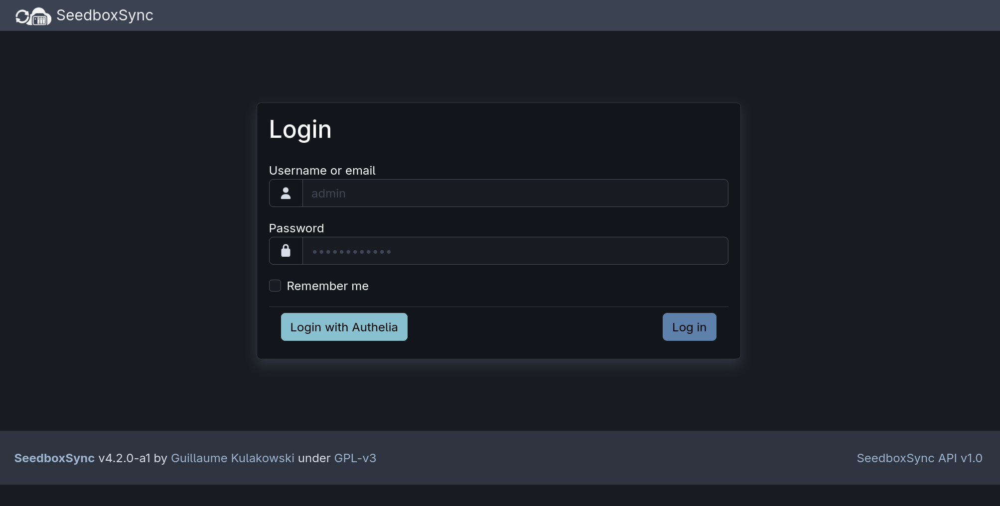</a>
                 <em>Login page (dark mode)</em>
            </td>
            <td align="center">
                <a href="../../images/screenshots/homepage.png">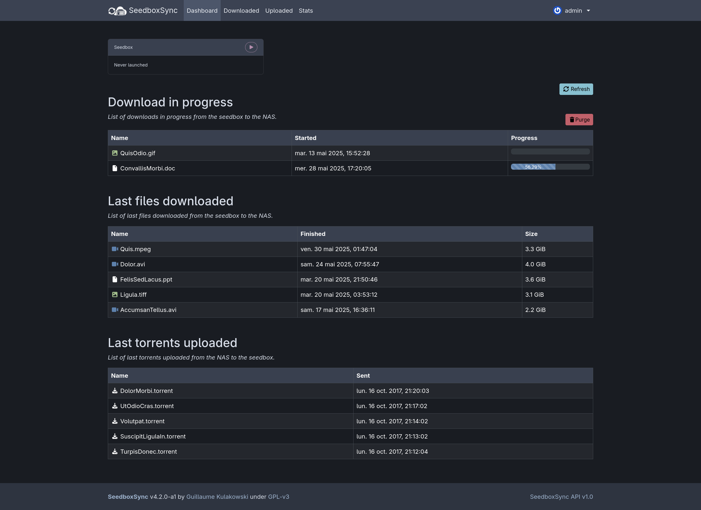</a>
                 <em>Main page (dark mode)</em>
            </td>
            <td align="center">
                <a href="../../images/screenshots/homepage_light.png">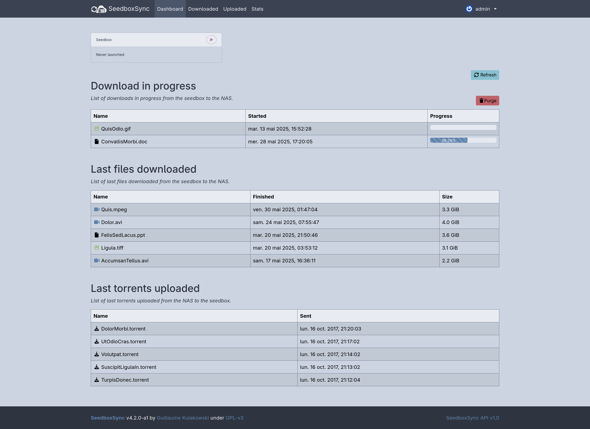</a>
                 <em>Main page (light mode)</em>
            </td>
        </tr>
        <tr>
            <td align="center">
                <a href="../../images/screenshots/downloaded.png">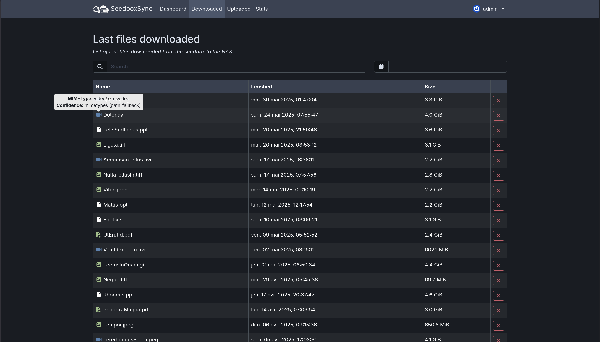</a>
                 <em>Downloaded files (dark mode)</em>
            </td>
            <td align="center">
                <a href="../../images/screenshots/downloaded_period.png">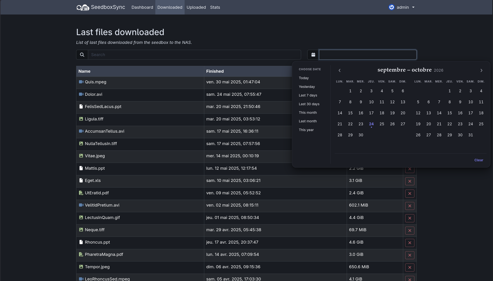</a>
                 <em>Downloaded files with date range filter (dark mode)</em>
            </td>
            <td align="center">
                <a href="../../images/screenshots/uploaded.png">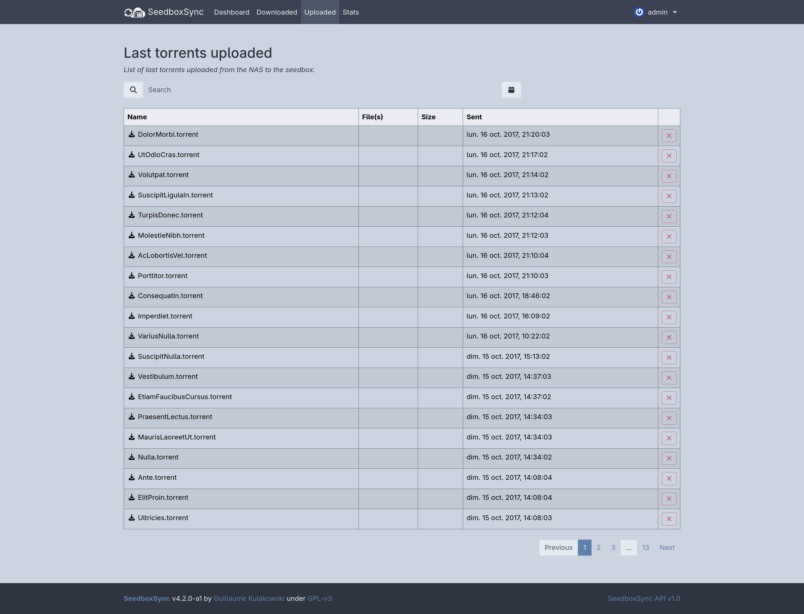</a>
                 <em>Uploaded torrents (light mode)</em>
            </td>
        </tr>
        <tr>
            <td align="center">
                <a href="../../images/screenshots/stats.png">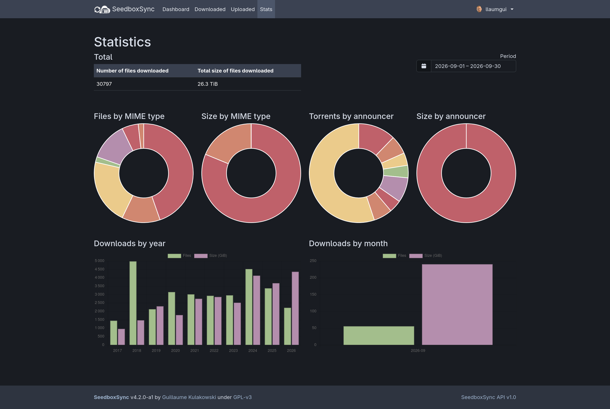</a>
                 <em>Statistics (dark mode)</em>
            </td>
            <td align="center">
                <a href="../../images/screenshots/info.png">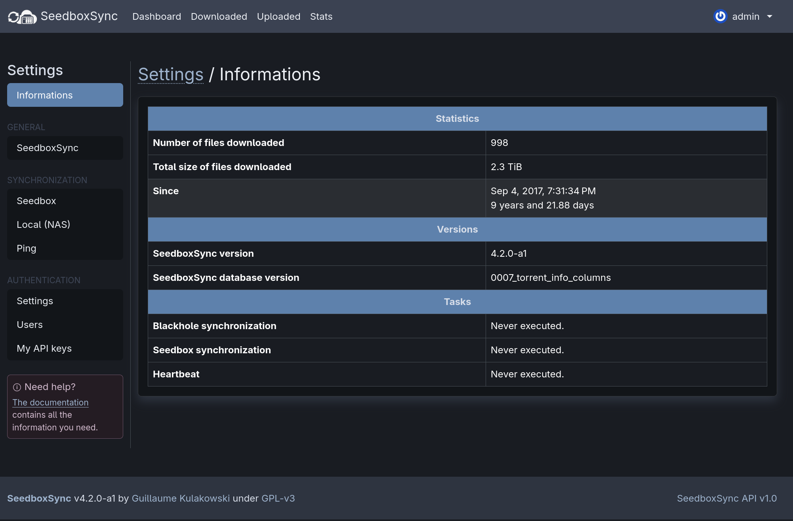</a>
                 <em>info (dark mode)</em>
            </td>
            <td align="center">
                <a href="../../images/screenshots/settings.png">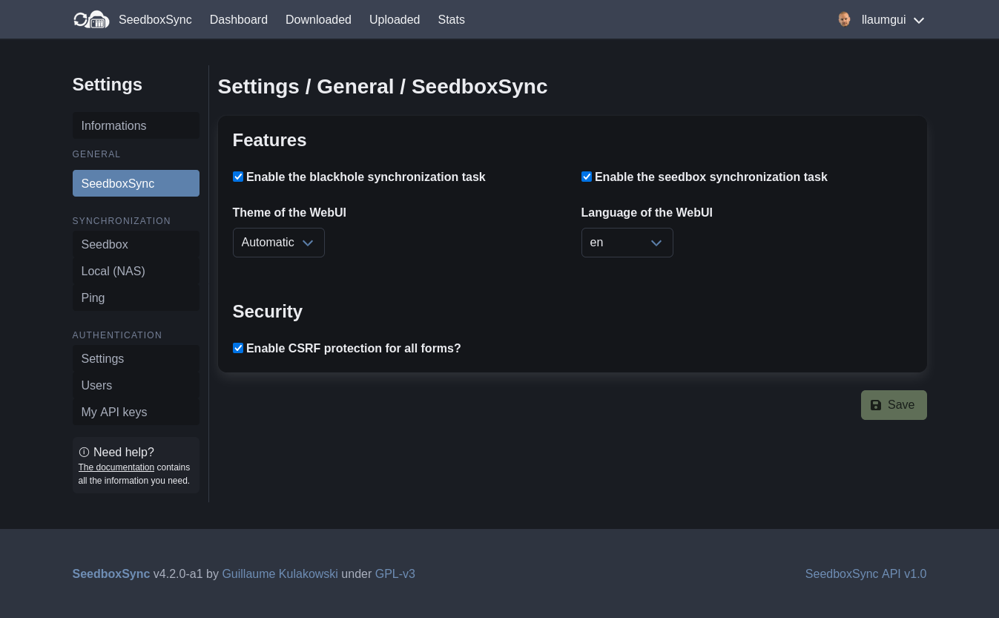</a>
                 <em>Settings for SeedboxSync (light mode)</em>
            </td>
        </tr>
        <tr>
            <td align="center">
                <a href="../../images/screenshots/settings_seedbox.png">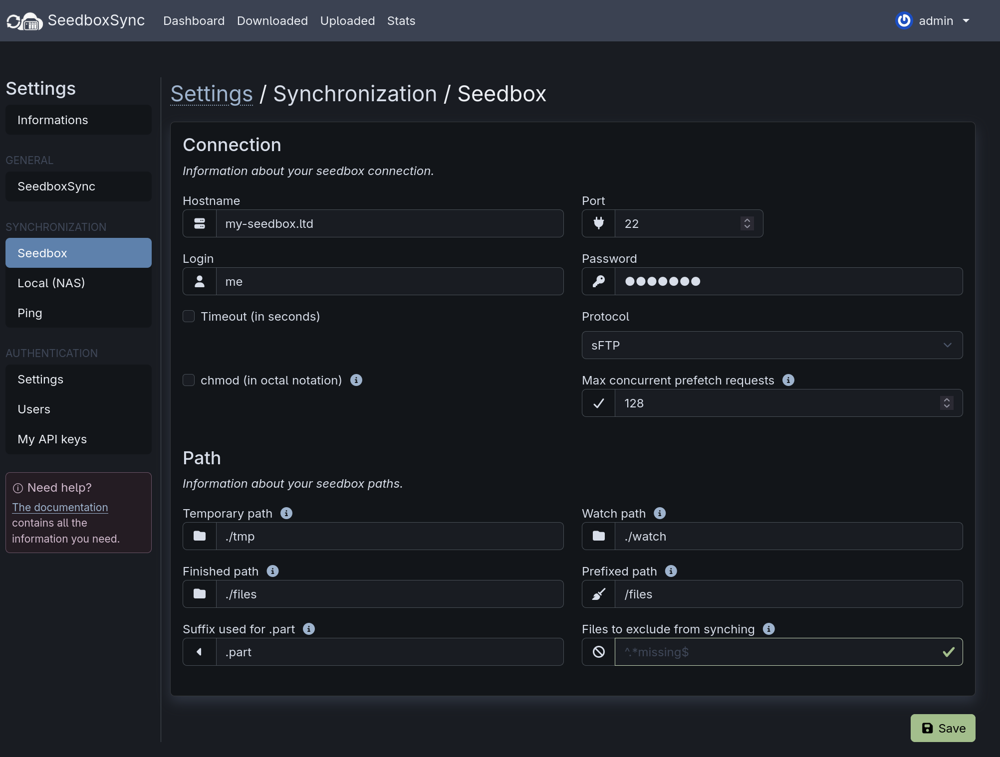</a>
                 <em>Settings for Seedbox (dark mode)</em>
            </td>
            <td align="center">
                <a href="../../images/screenshots/users_list.png">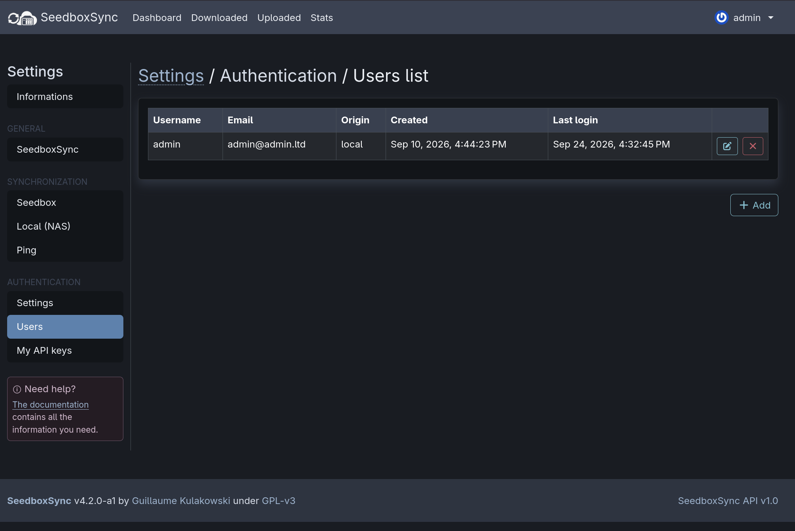</a>
                 <em>Users list (dark mode)</em>
            </td>
            <td align="center">
                <a href="../../images/screenshots/api-spec.png">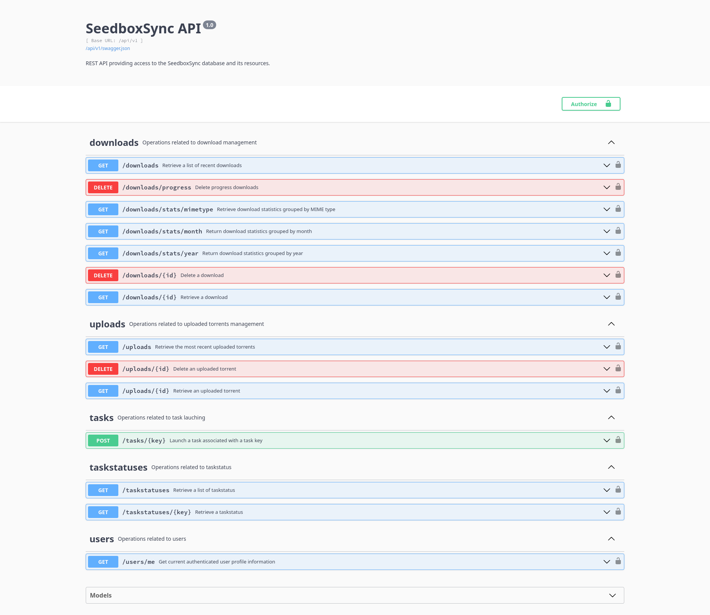</a>
                 <em>API</em>
            </td>
        </tr>
    </table>

