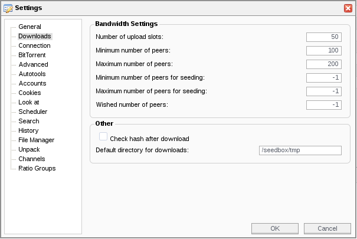

## Configuration file

### Docker way

> :information_source: **Recommended:** This is the recommended way.

The configuration file should be placed in `/conf`.

### Other ways

> :warning: **Warning:** Docker is the recommended method.

You can use [the example configuration file](https://github.com/llaumgui/seedboxsync/blob/main/config/seedboxsync.yml.example).
This example file can be located in:

* `/usr/local/config/` (pip install)
* `~/.local/config/` (pip install with user privileges)

To create your configuration directory and copy the example file:

```bash
mkdir -p ~/.config/seedboxsync
cp ~/.local/config/seedboxsync.yml.example ~/.config/seedboxsync/seedboxsync.yml
```

Or for a global configuration:

```bash
sudo mkdir -p /etc/seedboxsync
sudo cp /usr/local/config/seedboxsync.yml.example /etc/seedboxsync/seedboxsync.yml
```

Supported configuration file locations:

* `/etc/seedboxsync/seedboxsync.yml`
* `~/.config/seedboxsync/seedboxsync.yml`
* `~/.seedboxsync/config/seedboxsync.yml`
* `~/.seedboxsync.yml`

## Settings

### Seedbox and BitTorrent client configuration

First, set the connection information for your seedbox.
Currently, only SFTP is supported.

```yaml
#
# Information about your seedbox
#
seedbox:

  ### Connection information
  host: my-seedbox.ltd
  port: 22
  login: me
  password: p4sw0rd
  timeout: false

  ### Only 'sftp' is supported for now
  protocol: sftp

  ### Chmod torrent after upload (set to false to disable)
  ### Use octal notation, e.g. 0o644
  chmod: false

  ### Use a temporary directory for incomplete transfers (must be created manually)
  tmp_path: /tmp

  ### Your BitTorrent client's "watch" folder (must be created manually)
  watch_path: /watch

  ### The folder where your BitTorrent client puts finished files
  finished_path: /files

  ### Remove a prefix from the synced path (usually the same as "finished_path")
  prefixed_path: /files

  ### Exclude files with this suffix (e.g. incomplete downloads)
  part_suffix: .part

  ### Exclude files from sync using a regular expression (Python re syntax)
  ### Example: .*missing$|^\..*\.sw
  exclude_syncing: .*missing$|^\..*\.sw
```

**Notes:**

* To avoid permission issues between your transfer account and your BitTorrent client account, SeedboxSync can chmod the torrent file after upload.
* To prevent your BitTorrent client from watching (and using) an incomplete torrent file, SeedboxSync first transfers the torrent file to a temporary directory (`tmp_path`). Once the transfer and chmod are complete, the file is moved to the watch folder.
  The temporary folder must also be configured in your BitTorrent client for unfinished torrents.



* The `watch_path` is your BitTorrent client's "blackhole" or "watch" folder, used for blackhole synchronization.
* The `finished_path` is the folder where your BitTorrent client moves completed downloads. You can configure your client to use a specific folder for finished files.


### NAS / Local configuration

Your NAS configuration is defined in the `local` section:

```yaml
#
# Information about the local environment (NAS, etc.)
#
local:

  ### Your local "watch" folder
  watch_path: ~/watch

  ### Path where files are downloaded
  download_path: ~/Downloads/

  ### Path to the local SQLite database for tracking downloaded files
  db_file: ~/.config/seedboxsync/seedboxsync.db
```

### Ping service configuration

The ping service is triggered by the `--ping` argument.
Currently, only [Healthchecks](https://github.com/healthchecks/healthchecks) is supported.

#### Healthchecks

Add a Healthchecks configuration for each sync command:

```yaml
#
# Healthchecks ping service
#
healthchecks:

  ### Sync seedbox part
  sync_seedbox:
    ### Enable or disable the service
    enabled: true

    # Ping URL
    ping_url: https://hc-ping.com/ca5e1159-9acf-410c-9202-f76a7bb856e0

  ### Sync blackhole part
  sync_blackhole:
    ## Enable or disable the service
    enabled: true

    ## Ping URL
    ping_url: https://hc-ping.com/ca5e1159-9acf-410c-9202-f76a7bb856e0
```
