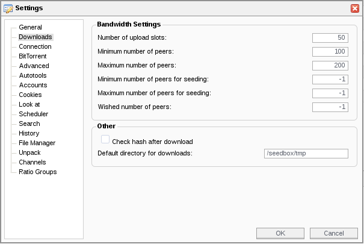
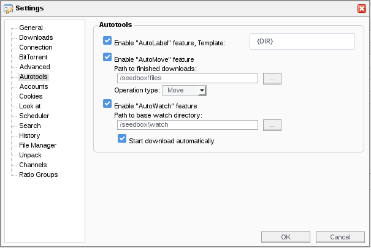

## Configuration file

### Docker way

> :information_source: **Recommended:** This is the recommended way.

The sqlite database file should be placed in `/conf`.

### Other ways

> :warning: **Warning:** Docker is the recommended method.

Supported qlite database file locations:

* `/etc/seedboxsync/seedboxsync.db`
* `~/.config/seedboxsync/seedboxsync.db`
* `~/.seedboxsync/config/seedboxsync.db`
* `~/.seedboxsync.db`

## Settings

> :information_source: Since SeedboxSync v4, all configuration is stored in the database, and settings have been moved to the web UI.

**Notes:**

* To avoid permission issues between your transfer account and your BitTorrent client account, SeedboxSync can chmod the torrent file after upload.
* To prevent your BitTorrent client from watching (and using) an incomplete torrent file, SeedboxSync first transfers the torrent file to a temporary directory (`tmp_path`). Once the transfer and chmod are complete, the file is moved to the watch folder.
  The temporary folder must also be configured in your BitTorrent client for unfinished torrents.

* The `watch_path` is your BitTorrent client's "blackhole" or "watch" folder, used for blackhole synchronization.
* The `finished_path` is the folder where your BitTorrent client moves completed downloads. You can configure your client to use a specific folder for finished files.

### Ping service configuration

The ping service is triggered by the `--ping` argument.
Currently, only [Healthchecks](https://github.com/healthchecks/healthchecks) is supported.
