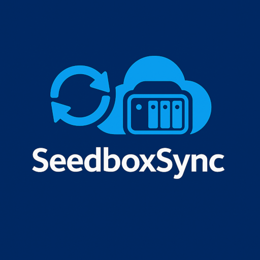

  

**SeedboxSync** provides a seamless and automated way to synchronize, download, and manage your torrents between your NAS and seedbox.

## Key Features

* **🔄 Two-way synchronization**:
    * Sync from NAS to Seedbox (upload blackhole folder)
    * Sync from Seedbox to NAS (automatic download with de-duplication tracking)
* **📥 Download management**: Prevent duplicate transfers using an integrated SQLite database
* **📊 Statistics and reporting**: View monthly and yearly download statistics
* **✅ Quality and testing**: Over 80% unit test coverage
* **🌐 Web frontend**: A web front-end is also available as a separate project if you don't want to use the CLI for management and reporting.

    

