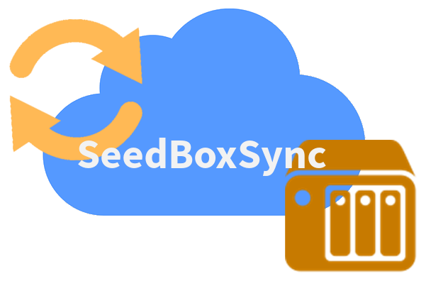

  

**SeedboxSync** is designed for users who run a NAS (Synology, TrueNAS, Unraid, Linux...) alongside a remote seedbox and want to automate torrent transfers without manual intervention.

**SeedboxSync** automates the complete lifecycle of your torrents between your NAS and your seedbox: upload `.torrent` files, download completed data, avoid duplicate transfers, and monitor everything from a web interface.

## Features

* **🔄 Torrent workflow automation**
    * Upload `.torrent` files from your NAS to your seedbox (blackhole directory).
    * Automatically download completed torrents back to your NAS.
* **📥 Smart download tracking**: Prevent duplicate transfers and keep track of downloaded torrents using an embedded SQLite database.
* **🌐 Web frontend**: Monitor your downloads and syncs in real-time through a user-friendly web interface.
* **📊 Statistics and reporting**: View monthly and yearly download statistics
* **🗄️ REST API**: Integrate SeedboxSync with your own tools and automation workflows.

## Build with

    

